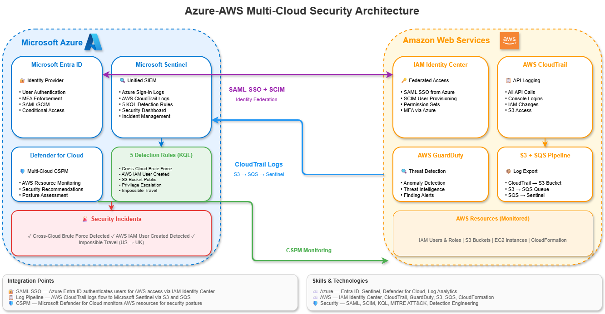

# Azure-AWS Multi-Cloud Security Integration

Enterprise multi-cloud security architecture integrating Microsoft Azure and AWS with unified identity management, centralized SIEM monitoring, and cross-cloud threat detection.



## Project Overview

| Component | Technology |
|-----------|------------|
| **Identity Federation** | Azure Entra ID → AWS IAM Identity Center (SAML SSO) |
| **Centralized SIEM** | Microsoft Sentinel (Azure + AWS logs) |
| **Cloud Security Posture** | Microsoft Defender for Cloud (multi-cloud) |
| **Log Sources** | AWS CloudTrail, Azure Sign-in Logs |
| **Detection Rules** | 5 custom KQL rules mapped to MITRE ATT&CK |

## Architecture

```
┌─────────────────────────────────────────────────────────────────────────┐
│                    MULTI-CLOUD SECURITY ARCHITECTURE                   │
│                                                                         │
│   ┌─────────────────────┐           ┌─────────────────────┐            │
│   │      AZURE          │           │        AWS          │            │
│   │                     │   SAML    │                     │            │
│   │  ┌───────────────┐  │   SSO     │  ┌───────────────┐  │            │
│   │  │  Entra ID     │◀─┼───────────┼─▶│ IAM Identity  │  │            │
│   │  │  (Identity)   │  │           │  │    Center     │  │            │
│   │  └───────────────┘  │           │  └───────────────┘  │            │
│   │                     │           │                     │            │
│   │  ┌───────────────┐  │   Logs    │  ┌───────────────┐  │            │
│   │  │  Sentinel     │◀─┼───────────┼──│  CloudTrail   │  │            │
│   │  │  (SIEM)       │  │  S3/SQS   │  │  GuardDuty    │  │            │
│   │  └───────────────┘  │           │  └───────────────┘  │            │
│   │                     │           │                     │            │
│   │  ┌───────────────┐  │  Monitors │  ┌───────────────┐  │            │
│   │  │  Defender     │──┼───────────┼─▶│  S3, EC2      │  │            │
│   │  │  for Cloud    │  │           │  │  IAM, etc.    │  │            │
│   │  └───────────────┘  │           │  └───────────────┘  │            │
│   │                     │           │                     │            │
│   └─────────────────────┘           └─────────────────────┘            │
│                                                                         │
└─────────────────────────────────────────────────────────────────────────┘
```

## Key Features

### 1. Identity Federation (SSO)
- Azure Entra ID as central identity provider
- SAML-based SSO to AWS IAM Identity Center
- SCIM provisioning for automated user sync
- MFA enforcement across both clouds

### 2. Centralized SIEM
- AWS CloudTrail logs ingested into Microsoft Sentinel
- S3 → SQS → Sentinel pipeline
- Unified security monitoring across clouds
- Single pane of glass for SOC analysts

### 3. Cross-Cloud Detection Rules
- 5 custom KQL detection rules
- Mapped to MITRE ATT&CK framework
- Real-time alerting on identity threats
- Correlation across Azure and AWS events

### 4. Multi-Cloud CSPM
- Microsoft Defender for Cloud monitoring AWS
- Unified security posture assessment
- Cross-cloud security recommendations

## Detection Rules

| Rule | Description | MITRE ATT&CK | Severity |
|------|-------------|--------------|----------|
| Cross-Cloud Brute Force | Same IP attacking both clouds | T1110 | High |
| AWS IAM User Created | New IAM user creation | T1136 | Medium |
| S3 Bucket Made Public | S3 exposure detection | T1530 | High |
| Cross-Cloud Privilege Escalation | Admin actions after Azure role assignment | T1078, T1098 | High |
| Impossible Travel (Azure) | Logins from multiple countries | T1078 | Medium |

## Simulations & Results

### Incidents Triggered
- ✅ **Cross-Cloud Brute Force** — Failed logins from same IP to Azure and AWS
- ✅ **AWS IAM User Created** — Detected test user creation in AWS

### Impossible Travel Evidence
- ✅ Azure logins detected from US and UK (VPN simulation)
- ✅ Cross-cloud SSO correlation showing UK login → AWS access

## Skills Demonstrated

| Category | Technologies |
|----------|--------------|
| **Cloud Security** | Multi-cloud architecture, Zero Trust |
| **Identity** | SAML SSO, SCIM, Identity Federation, MFA |
| **SIEM** | Microsoft Sentinel, KQL, Detection Engineering |
| **AWS** | IAM, CloudTrail, GuardDuty, IAM Identity Center |
| **Azure** | Entra ID, Defender for Cloud, Log Analytics |
| **Frameworks** | MITRE ATT&CK |


## Lessons Learned

### SSO and IP Attribution
When using SAML federation, AWS CloudTrail logs the identity provider's IP (Microsoft's servers) rather than the user's source IP. This affects cross-cloud impossible travel detection based on IP correlation.

**Solution:** Correlate by time windows rather than IP addresses, or implement separate impossible travel detection per cloud.

### CloudTrail Event Names
SSO logins appear as `AssumeRole` or `AssumeRoleWithSAML` events, not `ConsoleLogin`. Detection rules must account for federated authentication patterns.

## Certifications Applied

- **SC-300** — Identity and Access Administrator
- **SC-100** — Cybersecurity Architect Expert
- **AZ-900** — Azure Fundamentals
- **AWS DVA** — Developer Associate

## Setup Guide

See [docs/setup-guide.md](docs/setup-guide.md) for complete implementation instructions.

## Author

**Amogh Karankal**
- LinkedIn: [linkedin.com/in/amoghkarankal](https://linkedin.com/in/amoghkarankal)
- GitHub: [github.com/Amogh-Karankal](https://github.com/Amogh-Karankal)
